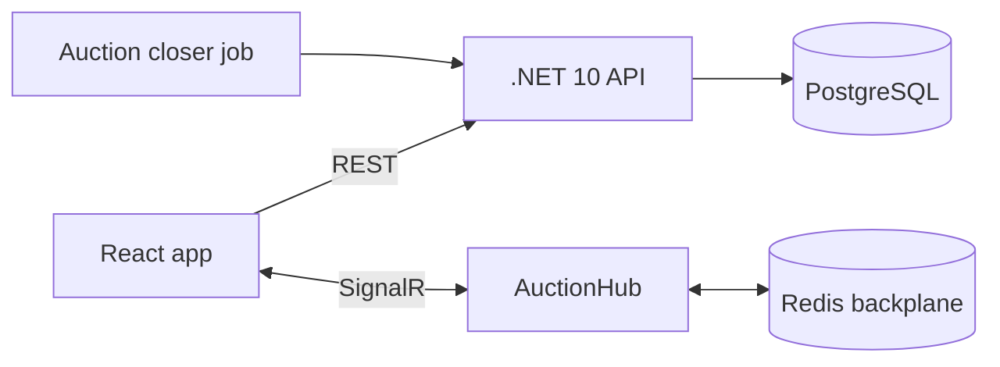

# #2 Realtime Auction / Bidding System — Plan

**Pitch:** A live auction for surplus freight containers. Bids update instantly for every viewer, and two bids placed at the same moment are resolved correctly.

**Status (2026-10-01):** steps 1–4 built and tested (40 backend + 8 frontend tests green), README + 6 ADRs written. Remaining: run the k6 test, deploy, GIF, `git init` + push.

**Stack:** .NET 10 API · React (Vite + TypeScript) · PostgreSQL · SignalR (Redis backplane) · xUnit · Docker

## Architecture (target)

## Steps

### 1. Setup (week 1)
- [x] Repo, compose (api, web, postgres, redis), CI
- [x] Entities: Auction, Lot, Bid, Bidder, AuctionStatus

### 2. Bidding core (week 1–2) — *the part that matters most*
- [x] Place bid: validate minimum increment, auction open, bidder not already highest
- [x] **Concurrency:** optimistic locking (`xmin` row version in PostgreSQL) **or** `SELECT … FOR UPDATE`. Pick one, write an ADR, and cover it with parallel-bid tests (done: 20 same-amount + 30 mixed-amount)
- [x] Idempotency key on bid requests (no double bids on retry)
- [x] Anti-sniping: a bid in the last 30s extends the end time

### 3. Realtime (week 2)
- [x] SignalR groups per auction; broadcast new highest bid, outbid notice, countdown sync
- [x] Redis backplane so it works with 2+ API instances (show this in the compose file)

### 4. React UI (weeks 2–3)
- [x] Auction list, auction room (live price, bid history, countdown), "you've been outbid" toast
- [ ] Record a GIF with two browser windows bidding against each other

### 5. Docs + deploy (week 3)
- [ ] Load test with k6 (e.g. 200 concurrent bidders) and put the results in the README
- [x] README, ER diagram, API docs (Scalar)
- [ ] Deploy to EC2 (files ready in `deploy/`)
- [x] ADRs: 6 in `docs/adr/` (concurrency, idempotency, scale-out, server clock + anti-sniping, PostgreSQL, demo bots)
