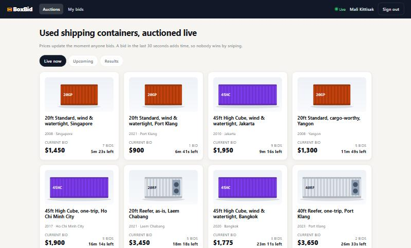
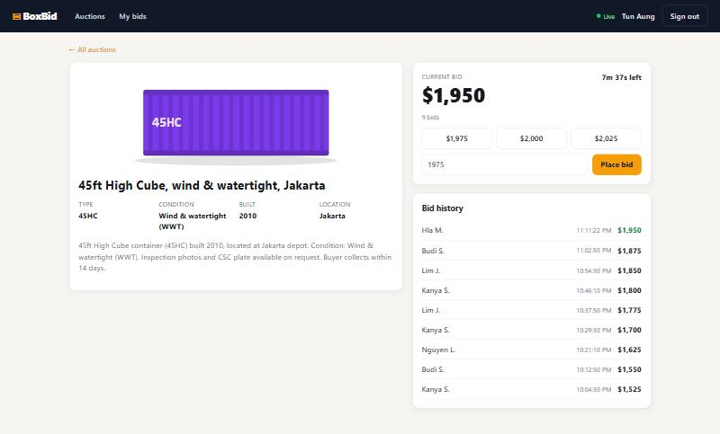
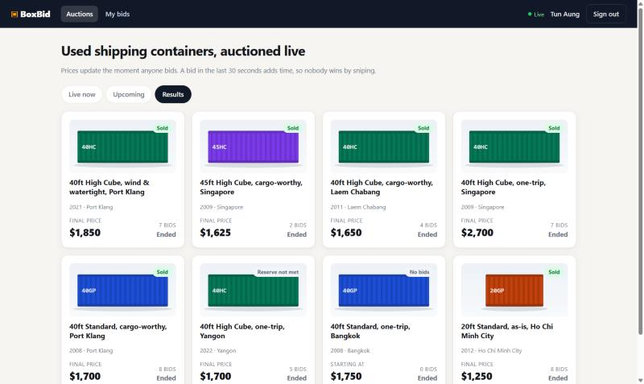
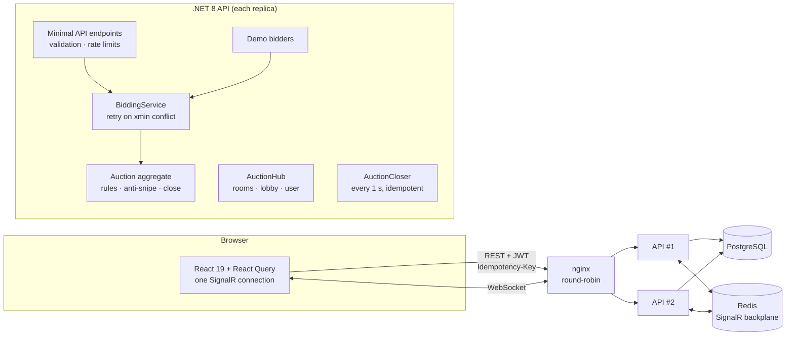
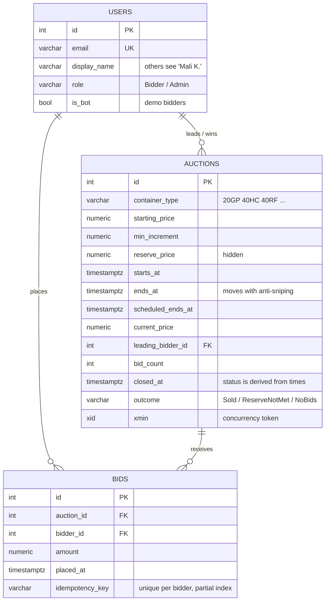

# BoxBid: Realtime Container Auctions

> Live auctions for used shipping containers. Prices update for every viewer the moment anyone bids, two bids at the same instant are resolved correctly, and late bids extend the clock so nobody wins by sniping.

[](https://github.com/arkarlin528/realtime-auction/actions/workflows/ci.yml)


**Live demo:** _coming soon_ · **Try it:** one-click demo bidders on the sign-in page · **API docs:** `/docs`



Part of a [connected logistics portfolio](https://github.com/arkarlin528). The same Clean Architecture as the [logistics tracking platform](https://github.com/arkarlin528/logistics-tracking-platform), but on **PostgreSQL + React**.

## What it shows

| Problem | How it's solved | Proof |
|---|---|---|
| Two people bid $1,050 at the same instant | Optimistic concurrency on PostgreSQL `xmin`. The loser is reloaded and re-checked: either it's still valid, or it gets "bid at least $1,100" | 20 parallel identical bids → exactly 1 accepted |
| A dropped response gets retried and bids twice | `Idempotency-Key` header + a partial unique index | Same key 5× in parallel → 1 bid |
| Sniping in the last second | A bid in the last 30 s extends the end ("soft close") | Fake-clock test, no sleeps |
| Client clocks are wrong | The server decides; clients sync an offset from `/api/time` and every message | `useServerNow()` shared ticker |
| Many API instances | Redis backplane + WebSocket-only (negotiation skipped), so no sticky sessions | `docker compose` runs 2 replicas |
| "You've been outbid" only to the right person | `Clients.User(sub)` over SignalR, while watching stays anonymous | Integration test: the outbid bidder is told, a bystander isn't |

| Auction room | Results |
|---|---|
|  |  |

## Architecture



### One bid, end to end
1. `POST /api/auctions/42/bids {amount: 1100}` with a JWT and an `Idempotency-Key`. It passes the per-user token-bucket rate limit and validation (> 0, at most 2 decimals).
2. `BiddingService` checks whether this key was already used; if so, it replays the original result.
3. It loads the auction, and `Auction.PlaceBid` enforces the rules: the auction is live, the bidder isn't already leading, and the amount is ≥ the minimum. A bid in the last 30 s also extends the end.
4. `SaveChanges` writes `UPDATE … WHERE xmin = @seen`. If another bid got there first, the service reloads and goes back to step 3, up to 5 times.
5. `BidPlaced` goes to `auction-42` and to `lobby` through Redis, so every replica's clients receive it. `Outbid` goes privately to the previous leader.
6. In the browser, the message patches the React Query cache: the price flashes, the history updates and the quick-bid buttons move. Nothing is refetched.

## Tech stack

| Tech | Why |
|---|---|
| **.NET 8, minimal APIs, Clean Architecture** | All rules sit in one aggregate; endpoints stay thin |
| **PostgreSQL + Npgsql EF Core** | `xmin` concurrency token, partial unique index, `numeric` money, snake_case naming |
| **SignalR + Redis backplane** | Room, lobby and per-user fan-out that works across replicas |
| **React 19 + TypeScript + Vite** | Strict types, fast builds |
| **TanStack React Query** | A server-state cache that SignalR writes into |
| **TimeProvider / FakeTimeProvider** | Time-dependent rules (anti-sniping, closing) are tested exactly |
| **xUnit + WebApplicationFactory**, **Vitest** | Real PostgreSQL in the integration tests; pure functions in the frontend tests |
| **Docker Compose, nginx, Caddy, GitHub Actions, k6** | Scale-out demo, HTTPS deploy, CI and a load-test script |

## Database



Only accepted bids are stored, so the history is always strictly increasing. Status (Scheduled, Live, Ending) is computed from the timestamps against the server clock; only *Closed* is persisted.

## API

Interactive docs (Scalar) are at **`/docs`**.

| Method | Path | Auth | Notes |
|---|---|---|---|
| GET | `/api/time` | — | Server clock for countdown sync |
| POST | `/api/auth/register` · `/api/auth/login` | — | JWT. Rate-limited per IP |
| GET | `/api/auctions?filter=Live\|Scheduled\|Closed` | — | Watching is public |
| GET | `/api/auctions/{id}` | — | Includes the top 25 bids (names shortened) |
| POST | `/api/auctions/{id}/bids` | Bidder | `Idempotency-Key` header. **200** accepted · **422** rule broken · **409** lost 5 races · **429** too fast |
| GET | `/api/me/bids` | Bidder | Leading / Outbid / Won / Lost |
| POST | `/api/auctions` | Admin | Schedule an auction |
| WS | `/hubs/auctions` | optional | `JoinAuction(id)`, `JoinLobby()` → `BidPlaced`, `AuctionClosed`, `AuctionCreated`, `Outbid` (signed in only) |

## Getting started

### Docker (2 API replicas + Redis + PostgreSQL)
```bash
git clone https://github.com/arkarlin528/realtime-auction.git
cd realtime-auction
cp .env.example .env        # change the secrets
docker compose up --build
```
Open **http://localhost:8081**. Use two browser windows with different demo bidders and bid against yourself, or against the simulated bidders.

### Local development
```bash
# PostgreSQL: create a local dev role once (or edit appsettings.Development.json)
psql -U postgres -c "CREATE ROLE auction_dev LOGIN CREATEDB PASSWORD 'auction_dev_local';"

dotnet run --project src/Bidding.Api          # http://localhost:5090/docs (migrates + seeds)
cd web && npm install && npm run dev          # http://localhost:5173 (proxies /api and /hubs)
```

## Design decisions
- [ADR-0001](docs/adr/0001-optimistic-concurrency-for-bids.md) Optimistic concurrency (`xmin`) with retry, compared with row locks, SERIALIZABLE and per-auction queues
- [ADR-0002](docs/adr/0002-idempotency-keys.md) Idempotency keys enforced by a partial unique index
- [ADR-0003](docs/adr/0003-scale-out-with-redis-backplane.md) Scale-out with a Redis backplane and no sticky sessions; migrations run once
- [ADR-0004](docs/adr/0004-server-clock-and-anti-sniping.md) Server-authoritative time, soft close, fake-clock testing
- [ADR-0005](docs/adr/0005-postgresql-conventions.md) PostgreSQL conventions, and why this project isn't on SQL Server
- [ADR-0006](docs/adr/0006-demo-bots-use-real-services.md) Demo bidders use the real bidding service

## Testing & CI

```bash
dotnet test           # 18 domain + 22 integration tests (integration needs PostgreSQL)
cd web && npm test    # 8 Vitest tests
```

- **Domain tests:** every bidding rule, anti-sniping and repeated extensions, closing outcomes, and name masking.
- **Integration tests** run against a throwaway PostgreSQL database with a `FakeTimeProvider`. They cover:
  - same-amount race (20 bidders);
  - mixed-amount race (30 bidders; history strictly increasing);
  - idempotent replays, sequential and parallel;
  - auction closing with winner and with reserve not met;
  - SignalR delivery: anonymous watcher, private outbid message, and the close notification;
  - auth and admin authorization.
- **Load test:** [`loadtest/bidding.js`](loadtest/bidding.js) is a k6 script for 200 virtual bidders on one auction. It hasn't been run yet, so there are no published results.
- **CI:** the backend against a PostgreSQL service container, frontend lint, tests and build, the Docker image builds, and a gitleaks secret scan.

## Deployment
EC2 + Docker Compose + Caddy (HTTPS), with images from GHCR, deployed by GitHub Actions. It can share an instance with the logistics platform. See [deploy/README.md](deploy/README.md).

## Roadmap
- [ ] Run the k6 test on the deployed stack and publish p95 and conflict rates here
- [ ] Proxy bidding ("bid up to $2,000 for me")
- [ ] Playwright end-to-end test: two browsers, one outbids the other
- [ ] .NET 10 upgrade (see the logistics platform roadmap)
- [ ] A GIF of a bidding war with an anti-snipe extension

## License
MIT. All companies, people and auctions are fictional.
